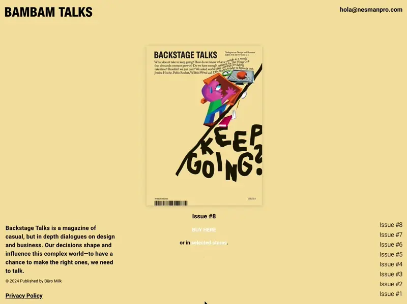

# Backstage Talks Recreation with Scroll Snapping and Animated Background-Color Transitions

## Description

This application is a recreation of the Backstage Talks Magazine website.

##Motivation

I practiced how to implement Scroll Snapping with responsiveness to both screen width and height. Additionally, I figured out how to hide the scrollbar when scroll snapping is active. I also practiced how to animate background color changes based on scroll position using the a custom `Observer` in JavaScript.

## Project Structure

The project is structured as follows:

### HTML

The HTML defines the basic structure of the website, including sections such as the magazine issues. Each section is decorated with classes used to apply styles and animations.

### SASS

The styles are organized into several SASS files to keep the code clean and modular:

- `abstracts`: Contains SASS functions, mixins, and variables.
- `base`: Defines base styles, including typography, resets, and common elements.
- `layouts`: Contains styles for the layout of different sections of the website, such as the fixed content and sections.
- `typography`: Manages the font styles used throughout the project.

### JavaScript

The JavaScript is organized into several classes to handle animations and user interactions:

- `app/index.js`: Main entry point that initializes the application and handles background color changes.
- `classes/Observer.js`: Base class that creates an Intersection Observer to detect when an element enters or leaves the viewport.
- `animations/ChangeBg.js`: Extends `Observer` to change the background color of the container based on the section in view.

## Class and Function Descriptions

- **Observer**: Base class that uses IntersectionObserver to detect when an element enters or leaves the viewport. Extended in other classes to handle specific animations upon entering or leaving the viewport.

- **ChangeBg**: Extends `Observer` to implement background color changes based on scroll position. Synchronizes the color transitions with the scrolling of the page, providing a seamless user experience.

- **App**: Main class that initializes the background color changing functionality by creating instances of `ChangeBg` for each section.
